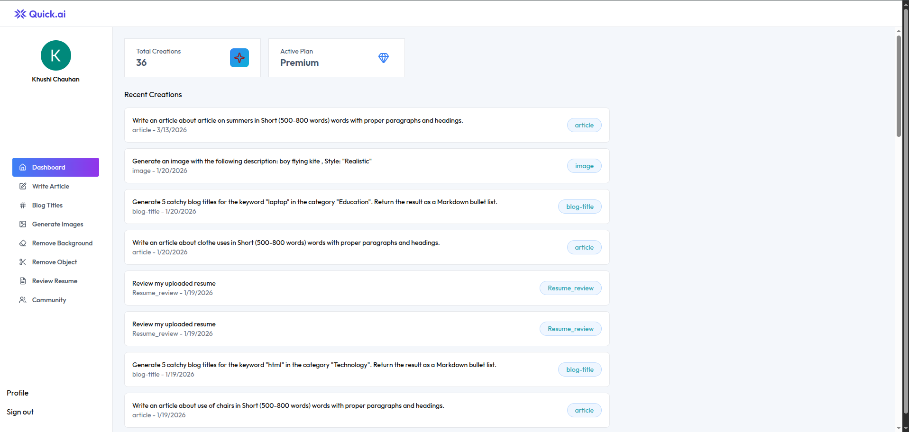

# 🚀 GenixAI

GenixAI is an AI-powered productivity platform that helps users generate content, create images, brainstorm ideas, and enhance workflows — all in one place.

---

## 📸 Project Preview

> Make sure to place your image inside an `assets` folder and name it `dashboard.png`.

---

## ✨ Features

- 📝 AI Article Generator  
  Generate well-structured articles with headings and proper formatting.

- 🎨 AI Image Generation  
  Create realistic or styled images using simple text prompts.

- 🏷️ Blog Title Generator  
  Generate catchy and SEO-friendly blog titles.

- 📄 Resume Review Tool  
  Upload resumes and get AI-powered feedback.

- 🧹 Background & Object Removal  
  Edit images easily with AI tools.

- 📊 Dashboard Overview  
  Track total creations and manage your activity.

---

## 🛠️ Tech Stack

### Frontend
- React.js / Next.js
- Tailwind CSS / CSS

### Backend
- Node.js / FastAPI

### AI & Tools
- OpenAI / Local LLMs
- Image Generation APIs
- Vector Database (if used)

---

## 📂 Project Structure

GenixAI/
│── frontend/
│── backend/
│── assets/
│   └── dashboard.png
│── README.md

---

## ⚙️ Installation & Setup

### 1. Clone the Repository
git clone https://github.com/your-username/genixai.git  
cd genixai  

### 2. Install Dependencies
# frontend  
cd frontend  
npm install  

# backend  
cd ../backend  
npm install  

### 3. Run the Project
# start frontend  
npm run dev  

# start backend  
npm start  

---

## 🚀 Future Enhancements

- Full-stack deployment (AWS / Vercel / Docker)  
- Custom AI agents integration  
- Offline AI support (RAG system)  
- Fine-tuned models  

---

## 🤝 Contributing

Contributions are welcome!  
Feel free to fork the repo and submit a pull request.

---

## 📜 License

This project is licensed under the MIT License.

---

## 👤 Author

Khushi Chauhan  
Passionate Developer | AI Enthusiast